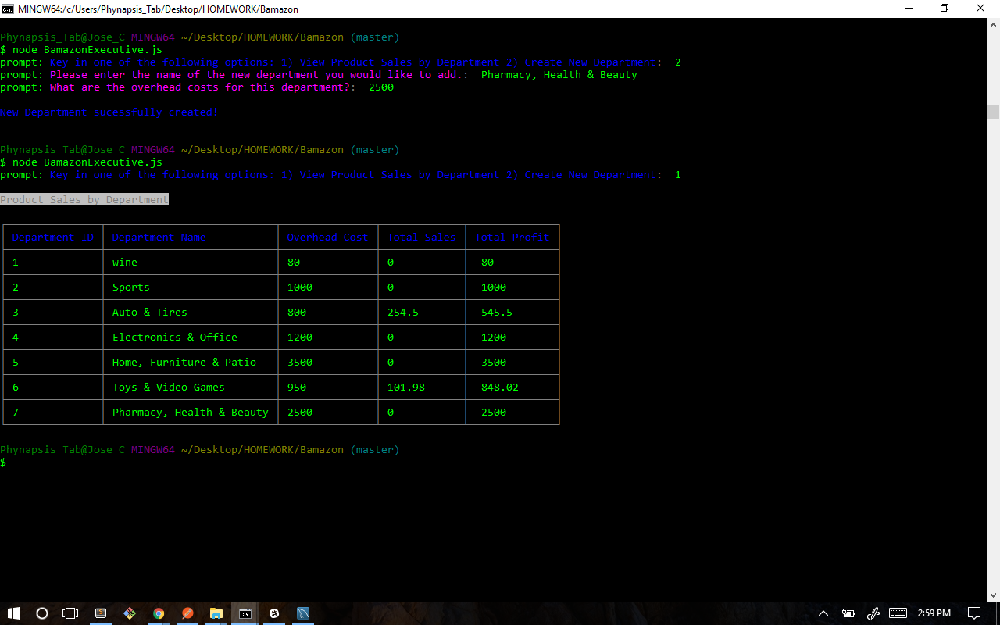

#Bamazon

In this project, in combination with Node.js & MySQL command line we are creating an "Amazon-like storefront". The app will take in orders from customers and deplete stock from the store's inventory. As a bonus task, the program app is able to track product sales across your store's departments and then provide a summary of the highest-grossing departments in the store.

### Overview

#My Videos
[click here to see Bamazon Live!](video) 

## Usage

1. Clone repo
2. npm install
3. cd Bamazon
4. node "selection"

## Contributing

1. Fork it!
2. Create your feature branch: `git checkout -b my-new-feature`
3. Commit your changes: `git commit -am 'Add some feature'`
4. Push to the branch: `git push origin my-new-feature`
5. Submit a pull request!

## Tech Used 

* Javascript
* nodeJS
* MySQL
* npm packages:
	- [mysql]
	- [prompt]
	- [colors/safe]
	- [cli-table]

#### Instructions:

### Challenge #1: Customer View (Minimum Requirement)

1. Database is called `Bamazon`.

2. There is a Table inside of that database called `Products`.

3. The products table was created with the following columns.

	* ItemID (unique id for each product)

	* ProductName (Name of product)

	* DepartmentName 

	* Price (cost to customer)

	* StockQuantity (how much of the product is available in stores)

4. I populated the database with 10+ different products. 

5. There is a Node application called `BamazonCustomer.js`. Running this application will first display all of the items available for sale. Include the ids, names, and prices of products for sale.

6. Bamazon then prompts users with two messages. 
	* The first ask them the ID of the product they would like to buy. 
	* The second message should ask how many units of the product they would like to buy.

7. Once an order has been placed the application then checks to see if the store has enough of the product to meet the user's request. 
	* If not, the app will log: `Insufficient quantity!`, and then prevent the order from going through.

8. However, if the store *does* have enough of the product, It will fulfill the users's order. 
	* This means updating the SQL database to reflect the remaining quantity.
	* Once the update goes through, it will show the customer the total cost of their purchase.

=================================================================================
## Examples:

### Table View

	| itemID | ProductName | DepartmentName | Price | StockQuantity |
	|--------|-------------|----------------|-------|---------------|
	| 01     | MacBookPro  | Electronics    | 1700  | 1000          |
	| 02     | Iphone6s    | Electronics    | 800   | 450           |

=================================================================================

### Interface
***
##### Bamazon Customer Portal
***

The Bamazon Customer Portal allows users to view the current items available for purchase.  The user will be prompted to enter the item id# and how many items they wish to purchase.  If the item is in stock, the order will be completed and the user will see the total amount of their purchase.

##### Bamazon Manager Portal
***

The Bamazon Customer Portal allows users to view and edit the inventory of the store.  The user will be prompted to choose from the following options:
* View products for sale
* View low inventory
* Add to inventory
* Add a new product

###### Manager Options 1 & 2
***

The first option allows the user to see the list of products that are currently for sale, what department the item belongs to, the price of the product and how much stock is left for that product.

The second option allows the user to see a list of all inventory items that have less than 5 items in stock.  If there are no products that meet this criteria, the user will see an empty table.

###### Manager Options 3 & 4
***

The third option allows the user to update the inventory for a specific product.  A prompt asks what the id is for the product the user wants to update.  A second prompt asks how many items the user wishes to increase the quantity by.

The last option allows the user to add a new product to the inventory.  Prompts ask the user for the product id#, the product name, the department name, the price and the stock quantity.

##### Bamazon Executive Portal
***

The Bamazon Executive Portal allows users to view the total profits of the store categorized by department and add new departments.  

